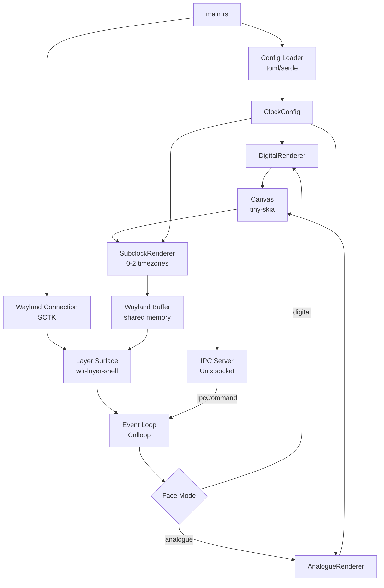
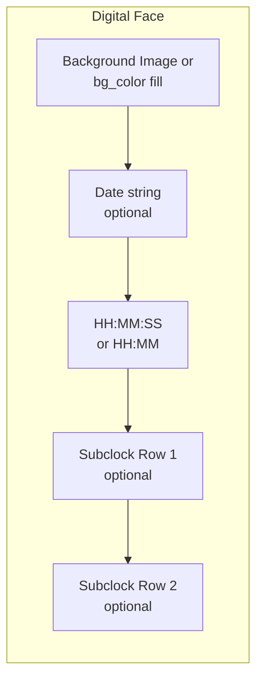
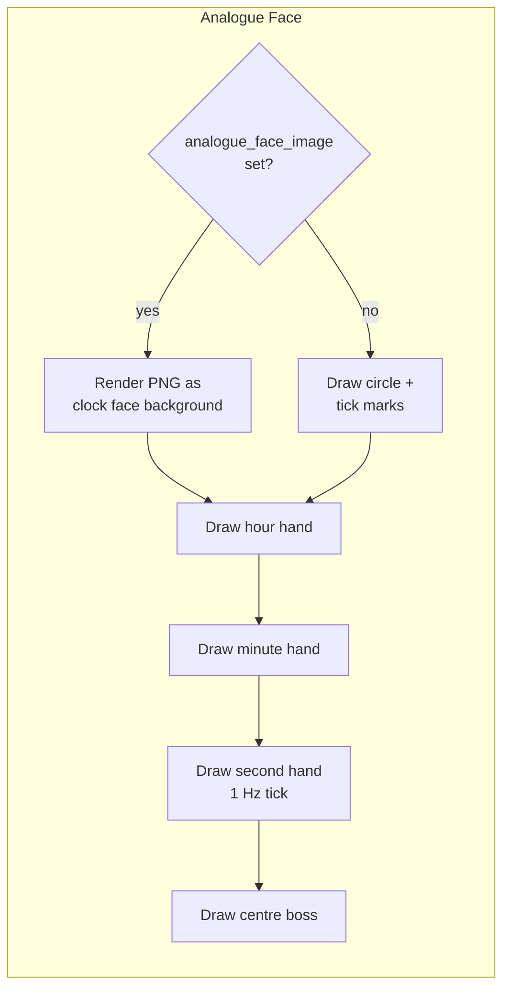
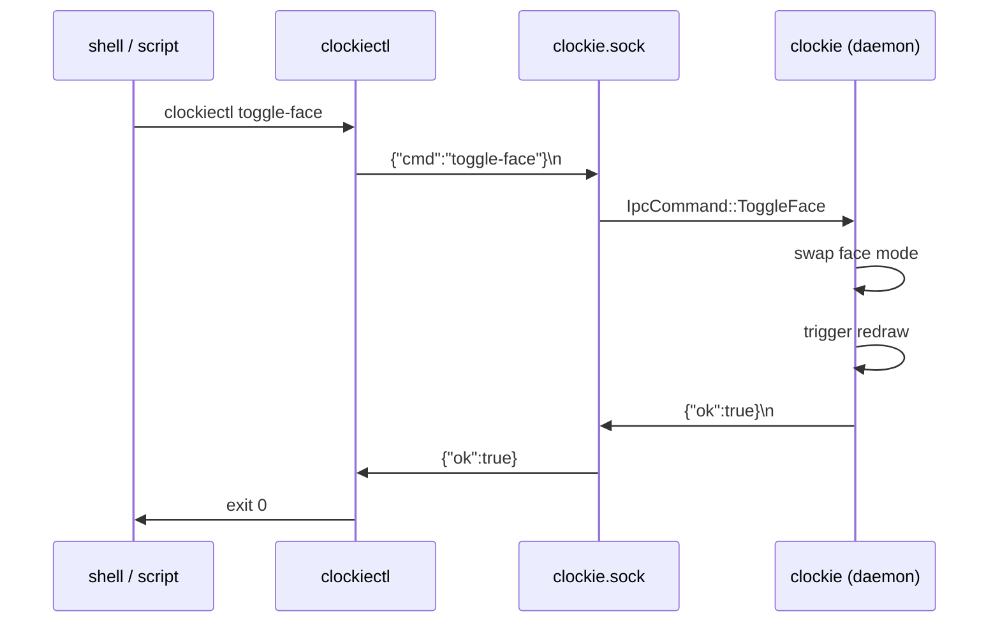
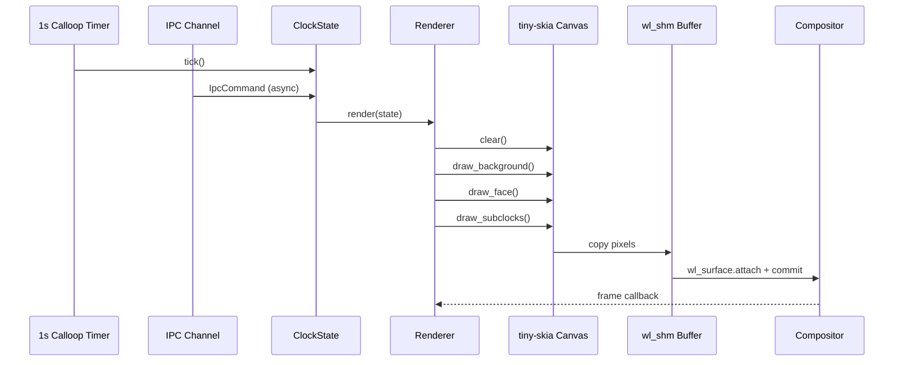

# PRD: `clockie` — Rust Layer-Shell Desktop Clock

**Version:** 1.1  
**Status:** Draft  
**Target:** claude-code / Rust implementation

---

## 1. Overview

`clockie` is a lightweight, resizable Wayland layer-shell clock widget written in Rust. It renders directly on the desktop layer (above wallpaper, below windows) using the `wlr-layer-shell` protocol. It supports digital and analogue faces, custom background images for each face, and up to two additional timezone sub-clocks beneath the primary display. A Unix domain socket IPC interface allows runtime control of all display modes without restarting the process.

---

## 2. Goals & Non-Goals

### Goals
- Minimal resource footprint — no Electron, no JS runtime, no GTK/Qt bloat
- Native Wayland via `wlr-layer-shell-unstable-v1`
- Resizable at runtime (drag-to-resize or IPC-driven)
- Digital face with optional background image
- Analogue face with optional PNG clock-face background image (replacing drawn tick marks)
- Ticking (1 Hz) second hand on analogue face
- Up to 2 additional timezone rows beneath the primary clock
- IPC socket for runtime control (face switching, compact mode, resize, config reload)
- Config file driven (TOML)
- Single statically-linked binary where possible

### Non-Goals
- X11 / XWayland support
- Calendar/agenda functionality
- Network time sync (relies on system time)
- Smooth/sweeping second hand animation (tick-per-second only)

---

## 3. Technology Stack

| Concern | Choice | Rationale |
|---|---|---|
| Language | Rust (stable) | Performance, safety, single binary |
| Wayland client | `smithay-client-toolkit` (SCTK) | Maintained, idiomatic Rust Wayland bindings |
| Layer shell | `zwlr_layer_shell_v1` via SCTK | Standard wlr protocol for desktop widgets |
| Rendering | `tiny-skia` | Pure-Rust 2D rasteriser, no C deps |
| Image loading | `image` crate | PNG/JPEG background support |
| Config | `toml` + `serde` | Simple, human-readable |
| Time / TZ | `chrono` + `chrono-tz` | Full timezone database |
| Font rendering | `fontdue` | Pure Rust, no C deps |
| IPC | Unix domain socket + JSON lines | Lightweight, scriptable, no extra deps |

---

## 4. Architecture



### Module Structure

```
src/
├── main.rs               # Entry point, event loop
├── config.rs             # ClockConfig, deserialization
├── ipc.rs                # Unix socket server + IpcCommand enum
├── renderer/
│   ├── mod.rs            # Renderer trait + ClockState
│   ├── digital.rs        # Digital face
│   ├── analogue.rs       # Analogue face
│   └── subclock.rs       # Timezone sub-rows
├── canvas.rs             # tiny-skia surface management
├── wayland.rs            # SCTK / layer-shell setup
└── time_utils.rs         # chrono helpers, TZ formatting
```

---

## 5. Configuration (`~/.config/clockie/config.toml`)

```toml
[window]
# Initial size in logical pixels
width  = 320
height = 240
# Layer: background | bottom | top | overlay
layer  = "top"
# Anchor edges: top | bottom | left | right (space-separated)
anchor = "top right"
# Margin from anchored edges (px)
margin_top   = 20
margin_right = 20
# Allow interactive resize via pointer drag
resizable = true
# Window opacity 0.0–1.0
opacity = 1.0
# Start in compact mode
compact = false

[clock]
# "digital" | "analogue"
face = "digital"
# 12 | 24
hour_format = 12
# Show seconds on digital face
show_seconds = true
# Show date line on digital face
show_date = true
# Date format string (chrono strftime)
date_format = "%A, %d %B %Y"
# Font: system font name or path to .ttf/.otf
font = "monospace"

[theme]
# Foreground colour (RRGGBBAA hex)
fg_color          = "FFFFFFFF"
# Background fill colour (used if no bg_image, or as scrim tint)
bg_color          = "000000CC"
# Analogue hand colours
hour_hand_color   = "FFFFFFFF"
minute_hand_color = "FFFFFFFF"
second_hand_color = "FF4444FF"
# Tick mark colour (used when no face image)
tick_color        = "CCCCCCFF"

[background]
# Path to a PNG/JPEG image to render behind digital clock text
# Empty = use bg_color fill
digital_image = ""
# Path to a PNG/JPEG image to use as the analogue clock face
# Replaces drawn circle, ticks and numerals — hands are drawn on top
analogue_face_image = ""
# Scale mode: "fill" | "fit" | "stretch" | "center"
image_scale = "fill"

[[timezone]]
label = "London"
tz    = "Europe/London"

[[timezone]]
label = "New York"
tz    = "America/New_York"
```

A maximum of **2** `[[timezone]]` entries are respected; additional entries are silently ignored.

---

## 6. Feature Specification

### 6.1 Digital Face



- Time rendered in monospace font, scaled to fit ~70% of widget height
- If `show_date = true`, date string renders above or below the time (auto-layout based on aspect ratio)
- Background image drawn first, full-bleed, respecting `image_scale`
- Text colour is `fg_color`; when a background image is present a semi-transparent scrim is applied using `bg_color` (with alpha) to ensure legibility

### 6.2 Analogue Face



- When `analogue_face_image` is set: the PNG is scaled to fill the clock area; tick marks and numerals are **not** drawn (assumed to be part of the image)
- Hands are always drawn on top of the face image
- Second hand advances by exactly 6° per second (no sweep/interpolation)
- Hand geometry scales proportionally with widget size
- Widget area for the analogue clock is square; if the container is non-square the clock is centred with letterboxing

### 6.3 Subclock Timezone Rows

- Up to 2 rows beneath the primary clock face
- Each row: **label** + **HH:MM** (or HH:MM:SS when `show_seconds = true`) in the target timezone
- Separated from primary clock by a 1px rule or padding gap
- Font size ≈ 25–30% of primary time font size
- Rows scale with widget resize

### 6.4 Compact Mode

Compact mode reduces the overall widget footprint for use in a corner or alongside other widgets:

- Primary time font scales down to ≈ 40% of normal size
- Date string hidden
- Subclock labels and times use minimal sizing
- Analogue face shrinks proportionally; hand weights adjusted so they remain visible
- Compact state is togglable via IPC at runtime

### 6.5 Resizing

- If `resizable = true`, the layer surface is resizable via pointer drag on edges
- On resize, the entire canvas redraws at the new size — all elements scale proportionally
- Minimum size: 120×80px logical pixels
- Last-used size is persisted to config on clean exit

---

## 7. IPC Interface

`clockie` listens on a Unix domain socket at `$XDG_RUNTIME_DIR/clockie.sock` (fallback: `/tmp/clockie-$UID.sock`). The companion binary `clockiectl` sends commands to this socket.

### 7.1 Protocol

Each message is a single line of JSON terminated by `\n`. Responses are a single JSON line with `{ "ok": true }` or `{ "ok": false, "error": "<reason>" }`.

### 7.2 IPC Command Reference

| Command | Payload | Effect |
|---|---|---|
| `set-face` | `{ "face": "digital" \| "analogue" }` | Switch face mode immediately |
| `toggle-face` | _(none)_ | Toggle between digital ↔ analogue |
| `set-compact` | `{ "compact": true \| false }` | Enter or leave compact mode |
| `toggle-compact` | _(none)_ | Toggle compact mode |
| `set-size` | `{ "width": N, "height": N }` | Resize widget to exact logical pixels |
| `resize-by` | `{ "delta": N }` | Grow (`+N`) or shrink (`-N`) width and height proportionally |
| `reload-config` | _(none)_ | Re-read config file; apply theme/background/timezone changes without restart |
| `get-state` | _(none)_ | Return current state JSON (see §7.3) |
| `quit` | _(none)_ | Cleanly shut down clockie |

### 7.3 State Response Schema

```json
{
  "face": "digital",
  "compact": false,
  "width": 320,
  "height": 240,
  "config_path": "/home/bazza/.config/clockie/config.toml"
}
```

### 7.4 IPC Flow



### 7.5 `clockiectl` Usage

```
clockiectl <COMMAND> [OPTIONS]

Commands:
  face digital|analogue     Set face mode
  face toggle               Toggle face mode
  compact on|off|toggle     Control compact mode
  size <W> <H>              Set exact size
  size +<N> | -<N>          Grow or shrink proportionally
  reload                    Reload configuration file
  state                     Print current state as JSON
  quit                      Shut down clockie

Options:
  --socket <PATH>   Override socket path
```

Examples:
```bash
clockiectl face toggle
clockiectl compact toggle
clockiectl size +40
clockiectl size 400 300
clockiectl reload
clockiectl state
```

---

## 8. CLI Interface (`clockie` daemon)

```
clockie [OPTIONS]

Options:
  -c, --config <PATH>     Path to config file [default: ~/.config/clockie/config.toml]
      --face <MODE>       Override initial face mode: digital | analogue
      --compact           Start in compact mode
      --tz1 <TZ>          Override first extra timezone (e.g. Europe/London)
      --tz2 <TZ>          Override second extra timezone
      --no-tz             Disable timezone sub-clocks
      --socket <PATH>     Override IPC socket path
  -h, --help              Print help
  -V, --version           Print version
```

---

## 9. Wayland Integration

- Protocol: `wlr_layer_shell_v1` (must be supported by compositor — niri ✓)
- Surface type: `wl_surface` backed by `wl_shm` shared memory buffers (double-buffered)
- Input: pointer events for resize handle detection only; no keyboard grab
- Surface namespace: `"clockie"`
- Exclusive zone: `0` (does not push window tiling)
- On compositor that does not support layer-shell, print a clear error and exit

---

## 10. Rendering Pipeline



- Redraw triggered by the 1-second calloop timer **or** by any IPC command that mutates display state
- No GPU required — pure CPU rasterisation via tiny-skia
- Buffer format: `ARGB8888` (wl_shm)

---

## 11. Non-Functional Requirements

| Requirement | Target |
|---|---|
| Memory usage (idle) | < 15 MB RSS |
| CPU usage (idle, 1 Hz redraw) | < 0.5% on a modern core |
| Binary size (release, stripped) | < 8 MB (combined clockie + clockiectl) |
| Startup time to first frame | < 200 ms |
| IPC round-trip latency | < 10 ms |
| Dependencies (C libs) | Zero (pure Rust preferred; libwayland via system is acceptable) |

---

## 12. File Layout (Deliverables)

```
clockie/
├── Cargo.toml
├── Cargo.lock
├── README.md
├── config.example.toml          ← well-commented example config
└── src/
    ├── main.rs                  # clockie daemon entry point
    ├── bin/
    │   └── clockiectl.rs        # clockiectl client binary
    ├── config.rs
    ├── ipc.rs                   # IpcCommand enum, socket server/client
    ├── canvas.rs
    ├── wayland.rs
    ├── time_utils.rs
    └── renderer/
        ├── mod.rs               # Renderer trait + ClockState
        ├── digital.rs
        ├── analogue.rs
        └── subclock.rs
```

---

## 13. Acceptance Criteria

- [ ] Both binaries (`clockie`, `clockiectl`) compile on stable Rust with `cargo build --release`
- [ ] `clockie` launches and renders on niri compositor without errors
- [ ] Digital face shows time, optional date, correct timezone
- [ ] Analogue face shows correct hand positions; second hand ticks at 1 Hz
- [ ] PNG background image renders on digital face when configured
- [ ] PNG clock-face image renders on analogue face with hands on top
- [ ] Up to 2 sub-timezone rows render and update correctly
- [ ] Widget resizes correctly — all elements scale proportionally
- [ ] Compact mode reduces widget footprint as specified
- [ ] `clockiectl face toggle` switches face mode with immediate redraw
- [ ] `clockiectl compact toggle` switches compact mode with immediate redraw
- [ ] `clockiectl size +40` increases widget size proportionally
- [ ] `clockiectl reload` re-applies config changes without restart
- [ ] `clockiectl state` returns valid JSON reflecting current state
- [ ] IPC socket created at `$XDG_RUNTIME_DIR/clockie.sock` on startup and removed on clean exit
- [ ] Memory < 15 MB, CPU < 0.5% in steady state
- [ ] Graceful error if layer-shell unsupported or image file not found (log + fallback, no crash)

---

## 14. Design Reference

The Figma prototype (`Desktop_Clock_Design`) defines the visual language:

- **Compact / expanded** states — both must work at the widget's resized dimensions
- **Digital face**: large monospace time string, smaller date below, timezone pills beneath with label + compact HH:MM
- **Analogue face**: clean circular face, three hands (hour/minute/second), centre boss, optional face image replacing drawn decorations
- Sub-timezone clocks use the `TimezoneClocks` compact layout: label above, time in a rounded card
- Default palette: dark background (`#1a1a2e`), white foreground (`#ffffff`), red second hand (`#ef4444`)

---

*End of PRD*
